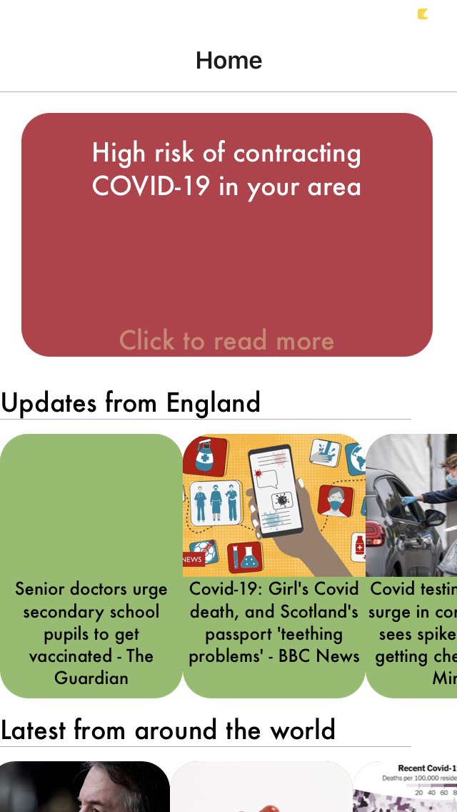
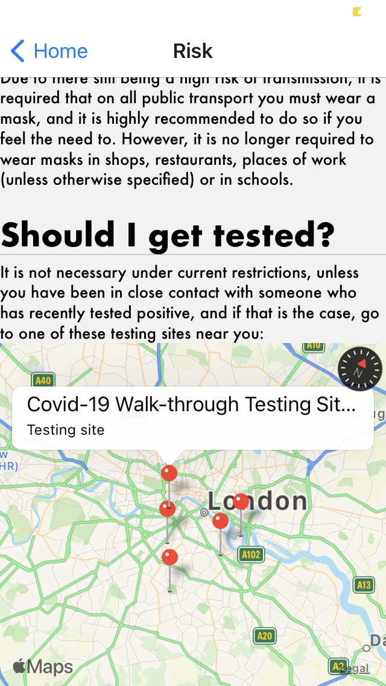

# covTracker

An app made in 48 hours for the 2021 NASA Space Apps Hackathon

## What is this for?

covTracker is a React Native application created in 48 hours for the 2021 NASA Space Apps Hackathon, where the prompt was to create a prototype app for mobile devices to keep social awareness of the current COVID-19 situation at an all time high, to stop the spread and transmission as much as possible.

## Screenshots

## Bugs

There are no known bugs at the time of submitting the project, however if you do for some reason look at the code and spot any, then feel free to open a issue. (Also this was my first time using React Native so any bad code is attributed to that :))
